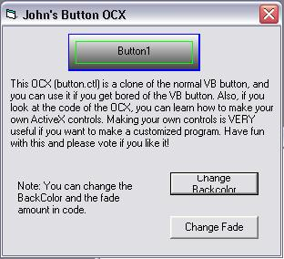



## JS Button \- same features as commandButton and more\!

### Description

This code is the source to the button OCX, (which includes some good 3d-fading code), and a demo on how to use it and change its properties. Good if you want to make your own OCXs, or just want to use nicer buttons in your programs. PLEASE vote and leave comments.
 
### More Info
 

             |
---                |---
**Submitted On**   |2002-08-09 17:24:24
**By**             |[john sheridan](https://github.com/Planet-Source-Code/PSCIndex/blob/master/ByAuthor/john-sheridan.md)
**Level**          |Beginner
**User Rating**    |4.3 (13 globes from 3 users)
**Compatibility**  |VB 6\.0
**Category**       |[Custom Controls/ Forms/  Menus](https://github.com/Planet-Source-Code/PSCIndex/blob/master/ByCategory/custom-controls-forms-menus__1-4.md)
**World**          |[Visual Basic](https://github.com/Planet-Source-Code/PSCIndex/blob/master/ByWorld/visual-basic.md)
**Archive File**   |[JS\_Button\_116393892002\.zip](https://github.com/Planet-Source-Code/john-sheridan-js-button-same-features-as-commandbutton-and-more__1-37783/archive/master.zip)

